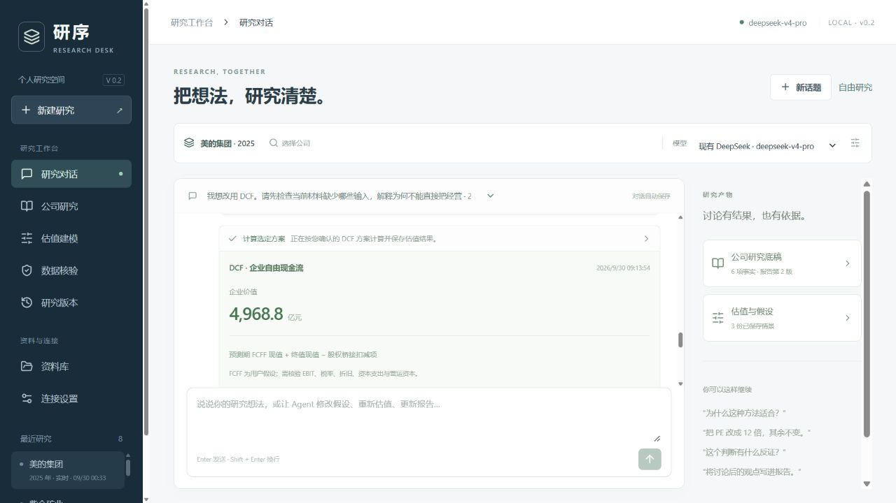
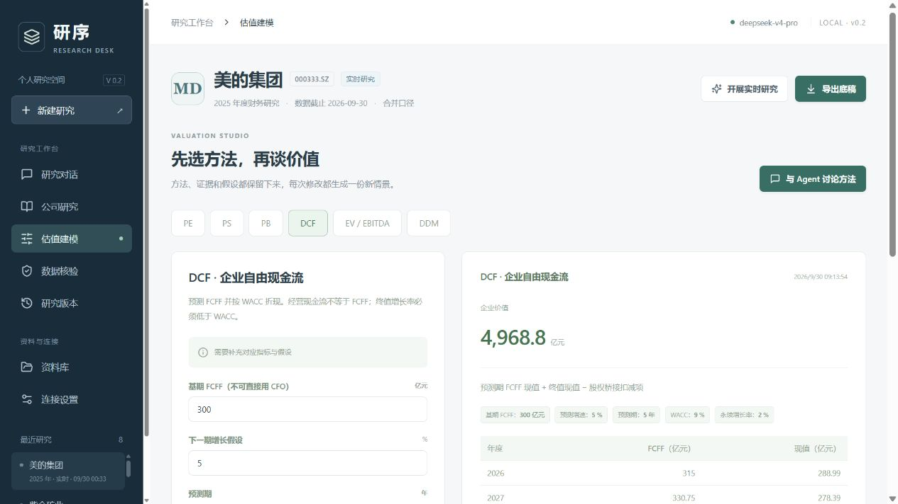

# 研序 v0.2 验收记录

验收日期：2026-09-30（北京时间）。运行地址：http://127.0.0.1:8920/ 。服务健康检查返回 0.2.0。验收在当前 Windows 本机完成。

本版落实四项反馈：可编辑的多模型连接与数据源、公司名称模糊搜索、能够调用工具改变研究结果的对话、多种估值方法与可采用的方案卡片。原有研究记录保留。

## 自动检查

- Python 测试：55 passed，覆盖原有财务核验以及新增连接、证券搜索、估值、对话执行和导出。存在一条 Starlette TestClient 使用 httpx 的弃用提示，不影响本次结果。
- TypeScript 检查与 Vite 生产构建通过。
- Python 依赖检查：No broken requirements found。
- 最终页面浏览器控制台未捕获 error / warn。
- 新保存密钥的 Windows DPAPI 加密往返、空输入保留密钥、换域名防止沿用旧密钥、API 不回传密钥均有测试覆盖。
- OpenAI 兼容与 Anthropic 请求适配通过模拟服务测试；不能据此宣称所有厂商、所有模型已经真实联网验证。

## 真实连接与搜索

在连接设置页面保留原有 DeepSeek 连接，空白密钥保存后仍可正常使用；“测试已保存连接”完成一次真实模型调用，页面显示 deepseek-v4-pro、约 1.3 秒；模型列表接口返回 2 个模型。未新增实际供应商密钥。

公司目录由 Tushare stock_basic 取得 5,571 条在市 A 股记录。浏览器输入“美的”匹配“美的集团 / 000333.SZ”；代码和 MDJT 拼音缩写也已验证。输入实时发起防抖搜索，目录为每日缓存，不是逐字重新下载全市场列表。无权限时可使用已有缓存或手动证券代码。

## 财务底稿与报告修订

验收研究 ID：7e281ca07b7e4ddc。公司为美的集团，研究年度 2025，截止日 2026-09-30。本次通过页面选择东方财富公开财务来源，与内置的公司年报摘要 PDF 交叉核对。

| 指标（人民币亿元） | 2025 | 2024 | 核验 |
|---|---:|---:|---|
| 营业收入 | 4564.51731 | 4071.49600 | 公开财务接口与披露一致 |
| 归母净利润 | 439.45411 | 385.37237 | 公开财务接口与披露一致 |
| 经营活动现金流量净额 | 533.45930 | 605.11572 | 公开财务接口与披露一致 |

上述两年共 6 项事实均为 verified。研究仍保留其他待核实项，不因六项数据核对成功就将公司研究标为完全充分。数据来源、PDF 定位、原始响应和同比计算见导出底稿与证据包。

在真实对话中要求将报告改为关注经营现金流风险，Agent 实际调用 revise_report，当前报告升为第 2 版，第 1 版及修改理由保留。页面“研究版本”和导出文件均已核验。新稿区分已核验事实与尚待核实的解释，保留反证和判断失效条件。

## 对话驱动的估值

以下参数均为验收时指定的探索假设，不是公司披露、市场预测或投资建议。

| 交互 | 保存的结果 | 验证点 |
|---|---|---|
| 以 2025 归母净利润为基数，下一年增长 10%，PE 15 倍 | 股权价值 7250.992815 亿元 | 调用计算工具并保存输入与依据；没有股本，不给每股值 |
| “把 PE 改成 12 倍，其余不变” | 股权价值 5800.794252 亿元 | 沿用增长 10%；相对上版减少 1450.198563 亿元，即 20% |
| 先讨论 DCF 所缺资料 | 尚不生成估值结果 | 指出 FCFF、WACC、预测与桥接等输入缺口，不用 CFO 直接替代 FCFF |
| 生成 DCF 方案：基期 FCFF 300 亿元、增长 5%、预测 5 年、WACC 9%、永续增长 2% | 待采用方案卡片 7f35a4e9 | 提议阶段不保存估值结果；参数明确标记为演示假设 |
| 点击“采用此方案并计算” | 企业价值 4968.8034579878 亿元 | 实际执行 calculate_proposal；方案变为已采用；逐年现金流与折现记录保存 |

DCF 预测期现值为 1342.7233688717 亿元，终值现值为 3626.0800891161 亿元，终值占比 72.9769%。未提供股权桥接扣减项与摊薄股本，因此股权价值和每股值均为空，未自动补零。

研究中共保存 3 份估值情景。对话消息、工具参数与结果均存于本地；刷新页面与切换页面后，当前公司选中的对话恢复。估值页面展示 PE、PS、PB、DCF、EV/EBITDA、DDM 六种方法、输入与历史记录。

真实验收使用两条对话：a905b6c5f5ed42f4、c357848968694362。开发调试过程中出现过模型只回复执行计划、方案仅输出文字、以及参数原话校验过严的情况；已补充动作完成检查与数值依据匹配，并重新执行成功。原失败记录仍在对话中，未删除或伪装成一次成功。

## 导出与交付

四种导出均返回 HTTP 200，并验证当前报告第 2 版、旧稿记录、6 项已核验事实、3 份估值结果完整保留。对导出正文及 ZIP 内每个成员检查了本机已有模型密钥和 Tushare Token，未发现明文凭据；ZIP 不包含连接设置或环境配置文件。

- [HTML 底稿](demo-report-v0.2.html)：可在浏览器打印为 PDF。
- [Markdown 底稿](demo-report-v0.2.md)
- [结构化 JSON](demo-report-v0.2.json)
- [ZIP 证据包](demo-report-v0.2.zip)：包括原始财务快照与源 PDF。
- [机器可读验收记录](acceptance-v0.2.json)
- [研发架构与后续范围](architecture-v0.2.md)

## 验收范围与未完成能力

真实联网验收覆盖当前 DeepSeek 模型、Tushare 证券目录、东方财富财务接口和美的集团披露文件。其他厂商协议为模拟测试；其他公司的字段适配、全部财务口径和各类 PDF 不在本次真实样本覆盖内。未进行手机断点验收或公网部署。

Agent 已能根据对话选择受限工具、修改参数、重算估值和修订报告；金融解释仍需人工审阅。初始财务底座仍聚焦收入、归母净利润、经营现金流两年年度数据。DCF 是恒定增长的 FCFF 预测与终值模型，尚未自动建立完整三表、分部驱动预测、资本支出或营运资本桥接；PB、EBITDA、股利等也需要补充资料或假设。尚无通用网络搜索、回测、持续公告监控或实盘交易。
