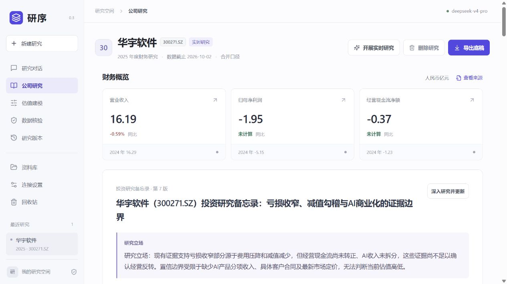

# 研序 v0.3.0 验收记录

日期：2026-10-02。服务：http://127.0.0.1:8920/ 。本轮以华宇软件真实研究和现有 DeepSeek 连接验收，未修改原用户对话及估值参数。

## 完成内容

- 界面改为中性色与靛蓝强调色，简化标签；宽版报告阅读区、按需展开财务来源、折叠运行细节，支持 Markdown 正文、表格、列表与链接。实际浏览器验收了来源展开/关闭、最终报告及导出菜单；无浏览器控制台错误。桌面和窄屏布局均已检查。
- 免搜索密钥联网渠道：财经公开索引、Bing、DuckDuckGo；官方披露目录、公告镜像及官方 PDF 阅读。支持多问题搜索、正文读取、跟进追问与官网链接，失败和日期未知均保留状态，不把搜索摘要当全文。
- 深度报告包括业务、竞争、经营质量、估值、催化剂、风险、验证计划；撰写与反方审阅启用 DeepSeek 思考模式，引用由程序绑定实际来源。反方可请求追查冲突。快速修订复用已有资料，明确没有额外反方审阅。
- 修复 PDF 多词搜索零命中、旧资料缺口不刷新、业务证据无法写报告、明确成稿请求只给计划、重复估值追加、来源上下文遗漏新公告，以及要求不重复联网时仍重跑搜索等问题。
- 资料上下文按文件及关键财务页分配，总摘录预算 65000 字符；额外提供实际已读页面目录。报告约束区分当期数和同比差额、合并税前科目与归母利润、冻结余额与现金流、历史价格与当前价格、TTM 与前瞻收入分母。

## 自动验证

- `python -m pytest -q`：164 项通过（20.98 秒），结果同时记录于 acceptance-v0.3.0.json。
- `npm run build`：TypeScript 检查和 Vite 生产构建通过。
- `python -m pip check`：无依赖冲突。
- 唯一测试警告为现有 Starlette/httpx 弃用提示。
- 覆盖来源/日期/URL 校验、PDF 页引用、取消与版本保留、精确查询及 SSRF 防护、XSS 转义、估值去重、已读资料修订调度及重复校验幂等性。

## 真实验收与保存版本

研究：`013b9220057f4337`；原用户对话：`9d239a4a39884b63`；验收对话：`62be84487ae44ab0`，标题“华宇软件 · 联网深度研究验收”。

最终报告为第 7 版，含 7 个研究章节、39 个被引用记录（包含财务事实、用户情景、PDF页及网页；不是39个独立媒体来源）。原用户第 2 版、自动生成中间版本及三条原 PS 情景均保留。最终导出文件：

- [HTML 报告](huayu-memo-v0.3.0.html)
- [Markdown 底稿](huayu-memo-v0.3.0.md)
- [结构化快照](huayu-memo-v0.3.0.json)
- [完整证据包](huayu-memo-v0.3.0.zip)

重要区分：第 5 版由真实模型修订工具生成，随后开发验收发现费用小计、当期与同比减值贡献、过时缺口和来源归属仍有错误。第 6、7 版是代码助手对照已取得原文、用 Decimal 复算后保存的开发复核修订；报告审阅记录明确注明这一点。它们不能被当作系统无需干预就已全自动正确的证明。原模型稿保留，未篡改成功率。

最终复核内容包括：2026H1收入同比以重述后同期基数计算；半年度现金流只与上年同期比较；2025三项费用减少219,819,871.55元，两项减值减少25,562,856.90元；2026H1减值当期净影响与同比变化分开；冻结存款为余额，不直接当经营现金流出；官方分部数据与独立AI商业化验证分开；原PS5倍、增长1%的情景未被改动。

## 剩余边界

- 免费检索可能限流、漏检，不能保证全网覆盖；长网页和 PDF 按相关页/摘录预算读取，尚非穷尽式阅读。公开远程PDF阅读限12MB/260页且未接OCR；本地上传PDF有独立OCR能力。
- 引用检查证明来源曾被取得，不能证明每个数字、因果关系与投资判断正确；反方模型本身也可能误判。自动完整利润桥、跨源数值逐项核对仍未完成。
- 本次六条结构化年度财务事实仍为 `api_only`；读到原文不自动升级为双源核验。
- AI付费合同/分项收入/回款证据、最新市场定价与同口径可比估值尚未补齐。完整三表预测和自动DCF不是本版已实现能力。
- 导出文件的本地PDF链接需研序服务运行；证据包另包含已接入的原始PDF。远程网页及公告通过原始链接访问。
- 深度研究调用可能需要数分钟；取消在外部请求返回后生效。

参考项目和原对话审计见 [借鉴与问题记录](reference-review-v0.3.md)。

